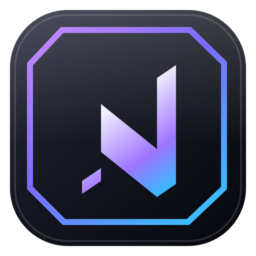

<p align="center">
  
</p>

<h1 align="center">Nexa Download Manager</h1>

A cross-platform, multi-connection download manager built to **beat IDM** —
segmented downloads, pause/resume, browser integration via native messaging,
media-stream grabbing, and more. C++ / Qt 6.

> Full roadmap & rationale: see the approved plan in
> `~/.claude/plans/` and the architecture notes below.

## What works today (Phase 0–6)

- **Segmented download engine** — splits a file into up to 16 byte-range
  connections (HTTP `Range`), writes each part in place into a pre-allocated
  file, and merges with zero final copy.
- **Pause / resume** — per-segment progress persisted to SQLite; resumes after
  app restart from exactly where it stopped.
- **Redirect + range-support detection** via a `bytes=0-0` probe.
- **Qt desktop UI** — live table of downloads with progress bars & speed.
- **Native messaging bridge** (`nexa-host`) + **IPC server** in the engine.
- **Browser extensions** (Chrome + Chromium MV3 + Firefox) — intercept downloads,
  capture cookies/UA/referrer, sniff HLS/DASH/media, right-click handoff.
- **Verified browser file downloads** — tested successfully with authenticated or
  signed attachments from **ChatGPT**, **Google Gemini**, **Google Drive**, and
  **Google Photos**. The extension forwards the browser's request context so
  private files and CDN-backed attachments can be downloaded by Nexa.
- **AI attachment provider registry** — the same browser-context handoff is now
  configured for **Claude**, **Grok**, **Perplexity**, **Mistral Le Chat**,
  **DeepSeek**, **Poe**, **Character.AI**, **Pi**, and **You.com**, including
  provider-owned asset/CDN hosts. Live validation of each provider still
  requires a signed-in browser session and a representative attachment URL.
- **HLS/DASH stream grabber** — parses `.m3u8` master + media playlists,
  picks the highest-bitrate variant, downloads all segments in parallel,
  passes through `#EXT-X-KEY` decryption, and muxes to MP4 with FFmpeg
  (`-c copy`, no re-encode). DASH `.mpd` handled via FFmpeg directly.
  *Verified end-to-end: a generated HLS stream grabs to a valid h264+aac MP4.*
- **Queue + scheduler** — a concurrency limit (default 4) keeps N downloads
  active and auto-promotes queued ones as slots free; `scheduleDownload()`
  starts a download at a future time. *Verified: with `--max=2`, 6 batched
  downloads never exceeded 2 concurrent and all were byte-correct.*
- **Batch add** — expands numeric ranges (`file[1-20].jpg`) and multi-URL
  lists into individual downloads.
- **Auto-categorize** — completed files are sorted into `Video/`, `Audio/`,
  `Documents/`, `Compressed/`, `Programs/`, `Images/`, `Other/`.
- **BitTorrent** — magnet links and `.torrent` files download in the *same*
  app via libtorrent (DHT + peer exchange), with live peers/seeds/speed and
  pause/resume. Something IDM can't do at all. *Verified end-to-end: a full
  755 MB Debian ISO downloaded from a live swarm with a SHA256 matching
  Debian's official checksum exactly.*
- **Remote web dashboard** — a built-in, dependency-free, hardened HTTP server
  serves a phone-friendly page + REST API to add/monitor/pause/resume/remove
  downloads, gated by a 128-bit access token (sent as a Bearer header).
  Loopback-only by default; `--dashboard-lan` exposes it to other devices.
  Has per-connection idle timeouts, a concurrent-connection cap, request-size
  limits and strict request parsing. *Verified by an adversarial code review +
  tests: token auth, slowloris cutoff, malformed-request rejection, and DoS
  resilience.*
- **AI assist** (Anthropic / Claude) — **smart auto-rename** turns
  `dl_98237.bin` into `Quarterly Earnings Report.bin` on completion; **Smart
  Add** takes a natural-language request ("grab these two files tonight at
  2am") and extracts the URLs + schedule. Available in the GUI, CLI (`--ai`),
  and dashboard (`POST /api/ai`); enabled when `ANTHROPIC_API_KEY` is set.
  *Verified end-to-end against a mock API: both rename and NL-command paths.*
- **Free plan is ad-supported, paid plans are not** — one sponsored strip above
  the download list on Free, managed by the site admin (`/admin/ads`: create,
  schedule, weight, pause, impressions/clicks/CTR). Pro and Team are ad-free and
  the API refuses to return an ad for a paid licence, so it is not just a
  client-side hide. Nothing is ever bundled into the installer.
- **64 built-in themes, each one moving differently** — a Themes gallery
  (View → Themes…, `Ctrl+Shift+T`) where every look is a live miniature of the
  app; clicking one applies it instantly, and a search box finds "comet" or
  "needle" as easily as "ocean". 42 dark and 22 light, plus "Match my system".
  A theme is more than a palette: each one has its own speed gauge (arc, ring,
  LED bars, analogue needle, orbit or liquid wave), its own sparkline (line,
  area, bars, dots, steps, ribbon), its own loading animation (bounce, shimmer,
  stripes, pulse, comet, dash, segments, wave), its own progress fill and its
  own tempo. No two themes share a gauge/spark/loader combination or an accent
  colour, and every one is contrast-tested in CI.
- **Modern themed UI** — brand header with live aggregate speed, color-coded
  status and progress bars, sharing the dashboard's palette, plus a Nexa
  app/extension icon set.
- **YouTube & 1000+ sites** — paste a YouTube URL (or use the extension's
  quality picker) and Nexa downloads it via **yt-dlp**, muxing the best
  video+audio to MP4 named from the title. *Verified: a real video downloaded
  as av1 240p + opus audio, merged and named from the page title.*

- **Everyday polish (0.2)** — menu bar with shortcuts (Ctrl+N, Space, Ctrl+F,
  Ctrl+,), tray notifications on finish/fail, a first-run setup guide, a
  scheduler (start later, survives restarts), post-download actions (open folder,
  sleep, shut down), an IDM-style link grabber for "Download all links", SHA-256
  verification from the Add dialog, a Settings toggle for the phone dashboard,
  automatic update checks with download-and-install, Export logs, and a 7-day Pro
  trial with a 7-day offline grace for paid plans.
- **Browser extension 0.2** — toolbar popup (engine status, on/off, pause-this-
  site, recent handoffs, grab links/media), options page (file types, minimum
  size, site list, notifications), real notifications and badge, Alt+Shift+N,
  store-ready packaging (`dist/nexa-chrome-store.zip` without the dev `key`).

## Build

Prerequisites (Debian/Kali):

```bash
sudo apt-get update
sudo apt-get install -y cmake ninja-build qt6-base-dev libqt6sql6-sqlite \
                        libtorrent-rasterbar-dev ffmpeg
```

`ffmpeg` is needed at runtime for the stream grabber;
`libtorrent-rasterbar-dev` for BitTorrent. Install `yt-dlp` (e.g.
`sudo apt-get install -y yt-dlp`) to download from YouTube and other sites.

Configure & build:

```bash
cmake -B build -G Ninja
cmake --build build
```

This produces `build/nexa` (the app) and `build/nexa-host` (the bridge).

## Run

```bash
./build/nexa                                       # open the UI
./build/nexa "https://example.com/big.iso"         # HTTP/FTP download
./build/nexa "https://site/playlist.m3u8"          # grab an HLS/DASH video
./build/nexa "magnet:?xt=urn:btih:..."             # BitTorrent
```

Use **Add URL** in the toolbar (it auto-fills a URL from your clipboard).

## Install the browser integration

1. Build the project (so `build/nexa-host` exists).
2. **Chromium:** go to `chrome://extensions`, enable Developer Mode,
   *Load unpacked* → select `extension-chromium/`. Copy the generated
   **extension id**.
3. Register the native host:
   ```bash
   ./native-host/install.sh ./build/nexa-host <chrome-extension-id>
   ```
4. **Firefox:** run `extension-firefox/build.sh`, then load
   `extension-firefox/manifest.json` via `about:debugging` → *This Firefox*
   → *Load Temporary Add-on*. The same `install.sh` already registered the
   Firefox host.

## Architecture

```
Browser Extension ──native messaging (framed JSON)──▶ nexa-host
        │                                                  │
        │ captures cookies / UA / referrer / media URLs    │ local socket (nexa-ipc)
        ▼                                                  ▼
   right-click / intercept                          Nexa Engine (Qt)
                                                     ├─ DownloadEngine
                                                     ├─ DownloadTask (segments)
                                                     ├─ SegmentDownloader ×N
                                                     ├─ IpcServer
                                                     └─ Database (SQLite)
```

## Roadmap (next)

- ~~Phase 4: HLS/DASH grabber → mux to MP4 with FFmpeg.~~ ✅ done
- ~~Phase 5: queues, scheduler, batch import, auto-categorize.~~ ✅ done
- ~~Phase 6: BitTorrent (libtorrent) · AI features · remote web dashboard.~~ ✅ done
- Phase 7: installers, auto-update.

### CLI flags

```
nexa [--max=N] [--no-categorize] [--batch] [--resume-all]
     [--dashboard[=PORT]] [--dashboard-lan] [--dashboard-token=TOK] <url|pattern>...
  --max=N            max simultaneous downloads (queue the rest)
  --no-categorize    save straight to the download dir (no type subfolders)
  --batch            exit once all downloads/streams finish (for scripts)
  --resume-all       resume downloads interrupted in the previous run
  --dashboard[=PORT] start the remote web dashboard (default port 8088, loopback)
  --dashboard-lan    bind to 0.0.0.0 (requires NEXA_TLS_CERT and NEXA_TLS_KEY)
  --dashboard-token  set the dashboard access token (otherwise auto-generated)
  --register-extensions
                     write the browser-extension auto-install hooks and exit
                     (Linux: run with sudo for non-.deb installs)
  --ai-rename        AI-rename files to clean names on completion (needs API key)
  --ai "<text>"      natural-language add/schedule, e.g. --ai "get these tonight"
  pattern            e.g. "http://host/file[1-20].jpg" expands to 20 downloads
```

### AI features (optional)

Set an Anthropic API key to enable smart-rename and Smart Add:

```bash
export ANTHROPIC_API_KEY=sk-ant-...
./build/nexa --ai-rename                       # auto-rename on completion
./build/nexa --ai "download the linux iso and the release notes at 2am"
```

Uses Claude Haiku by default (override with `NEXA_AI_MODEL`). Without a key, the
AI buttons/flags are inert and everything else works unchanged.

### Remote dashboard

```bash
export NEXA_TLS_CERT=/path/to/lan-cert.pem
export NEXA_TLS_KEY=/path/to/lan-key.pem
./build/nexa --dashboard --dashboard-lan
# prints: Nexa dashboard: https://<lan-ip>:8088/?token=<128-bit token>
```

Open that URL on your phone (same Wi-Fi) to add and control downloads. Without
`--dashboard-lan` the server is reachable only from `127.0.0.1`. The token is
required on every request.
LAN dashboard submissions accept public HTTP(S) targets only; loopback, private,
link-local, metadata, and local-name destinations are blocked, including redirects.
